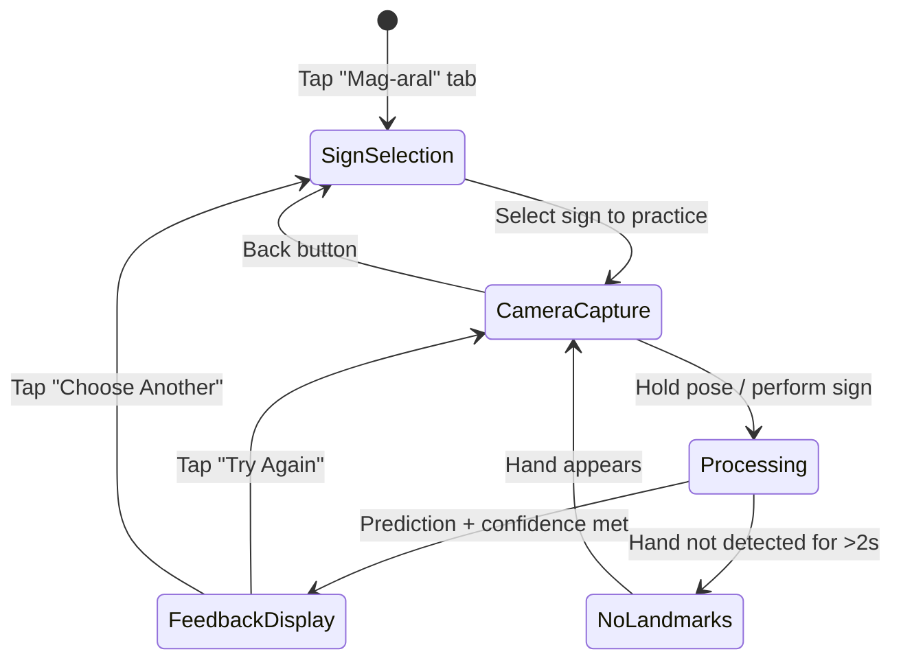

# Phase 11 — UX Flow Spec: Design

## 1. App Structure (Delivered)

5-tab shell matching approved Figma:

| Tab | Filipino Label | Function |
|-----|---------------|----------|
| Home | Home | Dashboard: recent activity, quick-start practice |
| Isalin | Isalin | Live translate (camera → prediction overlay) |
| Diksyunaryo | Diksyunaryo | Browse 50-sign dictionary with reference videos |
| Mag-aral | Mag-aral | Structured practice: pick sign → attempt → feedback → retry |
| Profile | Profile | Settings (theme toggle), session history |

## 2. Core Practice Flow (State Machine)

## 3. Screen States

### Sign Selection (Mag-aral tab)
- Grid of 50 signs grouped by category
- Each card shows: sign name, category badge, best attempt score (if any)
- Tap → enter practice mode for that sign

### Camera Capture (Practice Mode)
- Full-screen camera preview (front-facing, mirrored)
- Sign name displayed at top ("Practice: THANK YOU")
- Real-time landmark overlay (optional, togglable)
- Confidence indicator (progress ring filling as model confidence grows)
- "Recording..." indicator when gesture sequence is being captured

### Feedback Display (Bottom Sheet)
- Slides up over camera (camera stays visible but dimmed)
- Overall match percentage (large, colored: green >80%, yellow 50-80%, red <50%)
- Feedback items sorted by severity (worst first, max 3 shown initially)
- Each item: dimension icon + prompt text
- "Try Again" primary button
- "Show All Feedback" expandable if >3 items
- "Choose Another Sign" secondary action

### Error States

| State | Condition | User-Facing Behavior |
|-------|-----------|---------------------|
| No landmarks | MediaPipe detects no person/hands for >2s | Overlay: "Wala kaming nakikitang kamay — please face the camera and keep your hands visible" |
| Low confidence | Model confidence <50% after sign captured | "Hindi sigurado — try signing more clearly" with option to retry |
| Model load failure | TFLite model fails to initialize | Error screen: "Hindi ma-load ang model — please restart the app" |
| Camera denied | User denies camera permission | Explanation screen + "Open Settings" button |
| Ambiguous sign | Top-2 predictions within 10% confidence | Show both candidates: "Did you mean X or Y?" |

### Empty States

| State | Condition | Behavior |
|-------|-----------|----------|
| No practice history | First time in Mag-aral | Welcome message + guided first-practice prompt |
| No attempts for sign | Selecting a sign never practiced | "Wala ka pang attempt — start practicing!" |

## 4. Live Translate Flow (Isalin Tab)

- Full-screen camera with live prediction overlay
- Shows: predicted sign name, confidence %, FPS counter
- No feedback (just recognition) — for casual exploration
- No recording/logging (privacy by default)

## 5. Dictionary Flow (Diksyunaryo Tab)

- Searchable/filterable list of 50 signs
- Each entry shows: sign name, category, reference thumbnail
- Tap → detail view with gold-standard reference (looping video or landmark animation)
- "Practice This Sign" button → navigates to practice mode

## Status

**Complete.** UI delivered matching Figma; spec formalizes for future reference.
